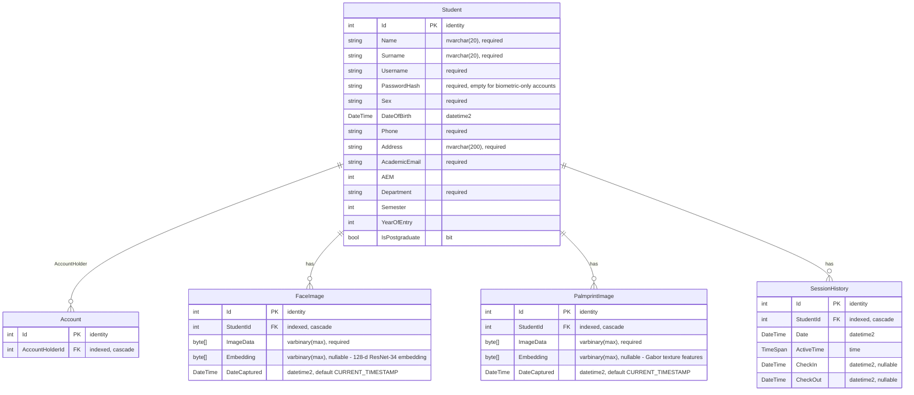
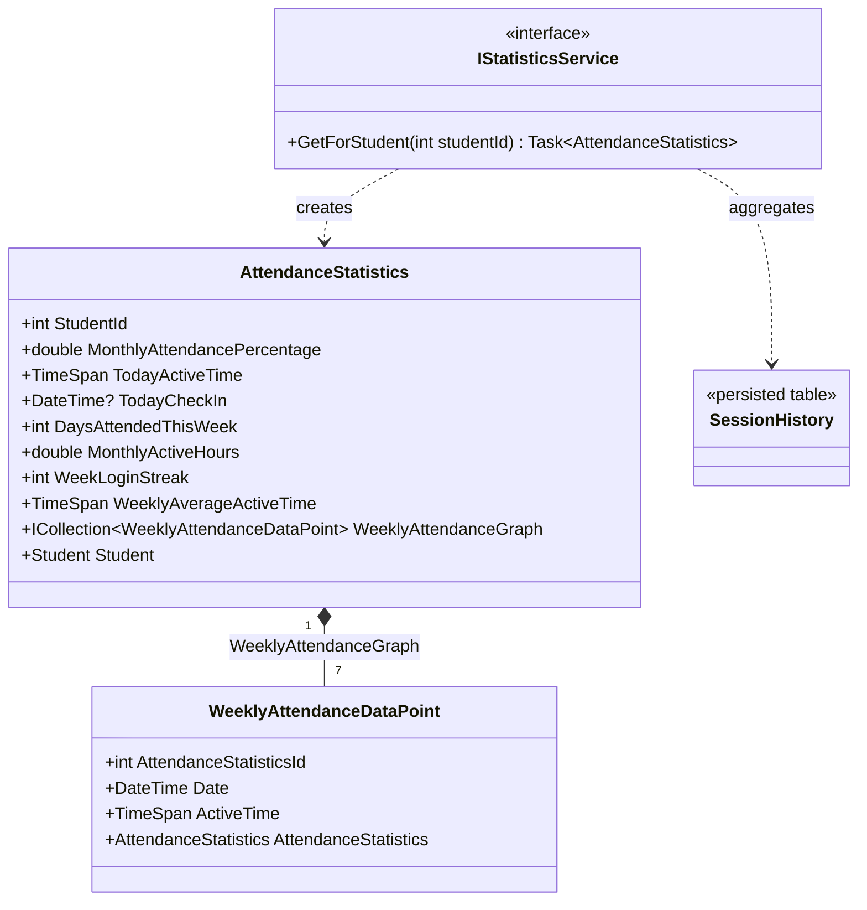

# AristotelisThesis.Domain - Entity Relationship Diagram (ERD)

This document visualizes the domain models of the `AristotelisThesis.Domain` project and how they
map to the database.

> Not every domain model is a table. The schema below is the **persisted** part, taken from
> `AristotelisThesisDbContext` and `AristotelisThesisDbContextModelSnapshot`. The statistics
> models are a **derived read-model** and are documented separately further down.

## Persisted schema

Five entities are mapped: `Students`, `Accounts`, `FaceImages`, `PalmprintImages` and
`SessionHistories`. These are the `DbSet`s on the context and the only entities present in the
migrations.

### Notes on the persisted schema
- All entities inherit from the base `DomainObject` class, which provides the `Id` primary key.
- `Student` is the root entity. Every other table points at it through a **required** FK with
  `OnDelete(DeleteBehavior.Cascade)`, so deleting a student removes their account, biometric rows
  and session history.
- Every relationship is configured as `HasOne(...).WithMany()` — the principal side has no
  collection navigation property, which is why `Student` has no `ICollection<>` members.
- `Account → Student` is modelled as one-to-**many** at the schema level: `AccountHolderId` has a
  plain (non-unique) index. The application only ever creates one `Account` per `Student`, but the
  database does not enforce that.
- `PasswordHash` is `required` in the schema, yet the current biometric registration flow
  (`Register06WithFaceViewModel`) stores an empty string and `Username` is set to the academic
  email — login happens through face or palmprint, not through typed credentials. The older
  `AuthenticationService.Register(...)` path still hashes a real password.
- Registration enrols 7 `PalmprintImage` rows and 7 `FaceImage` rows per student; login compares a
  probe embedding against the average L2 distance to a student's stored rows.

## Derived read-model (not persisted)

`AttendanceStatistics` and `WeeklyAttendanceDataPoint` are **not tables**. They have no `DbSet`,
no migration and no columns. `StatisticsService.GetForStudent(studentId)` projects them from the
student's `SessionHistory` rows every time the Statistics page is opened, and the result is never
written back. The `Id` / `StudentId` / `AttendanceStatisticsId` properties they inherit or declare
are plain in-memory fields, not keys.

### Notes on the read-model
- `WeeklyAttendanceGraph` always contains **exactly 7** points, one per day of the current
  Monday-based week, with `ActiveTime` zero for days with no session.
- An open session (checked in, not yet checked out) is counted live against the current time, so
  the values change between two calls on the same day.
- `MonthlyAttendancePercentage` counts **weekdays only**: attended weekdays so far this month
  divided by elapsed weekdays.
- `WeekLoginStreak` counts consecutive attended days ending today, or ending yesterday if the
  student has not checked in yet today.
