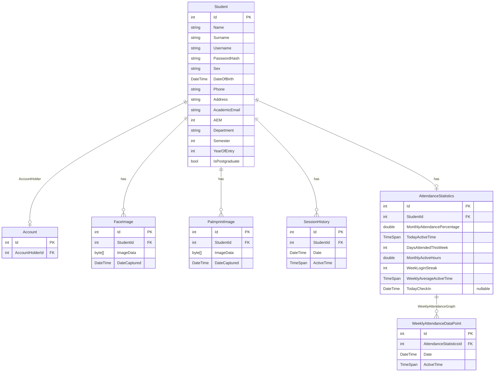

# AristotelisThesis.Domain - Entity Relationship Diagram (ERD)

This document visualizes the domain models and their relationships within the `AristotelisThesis.Domain` project.

## ERD Diagram

## Notes
- All entities inherit from the base `DomainObject` class, which provides the `Id` primary key property.
- `Student` acts as the primary entity and has relationships with images, session history, and attendance.
- `Account` holds a reference to a `Student` (the `AccountHolder`).
- `AttendanceStatistics` tracks overall attendance metrics and has a one-to-many relationship with `WeeklyAttendanceDataPoint` to construct a graph/history of the week's data.
