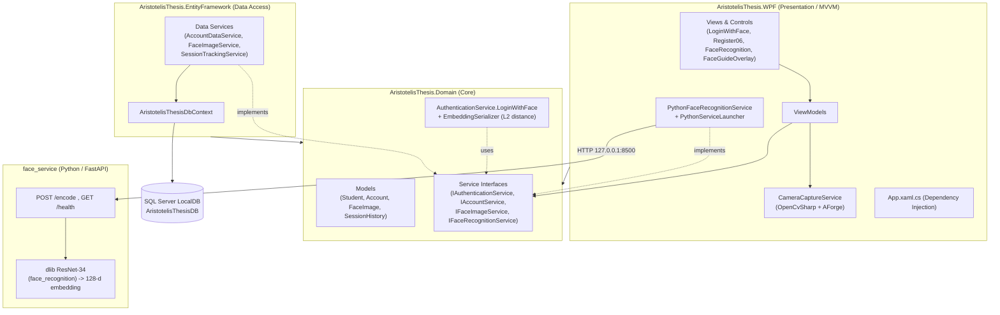

# System Architecture

Layered architecture of the .NET solution plus the external Python face-embedding service.
Arrows point in the direction of dependency / calls.

**Key idea:** the Python service is a *stateless encoder*; embeddings are stored in the
database and **matching happens in C#** (Domain layer). Camera capture stays in C#; only the
captured JPEG crosses to Python.
