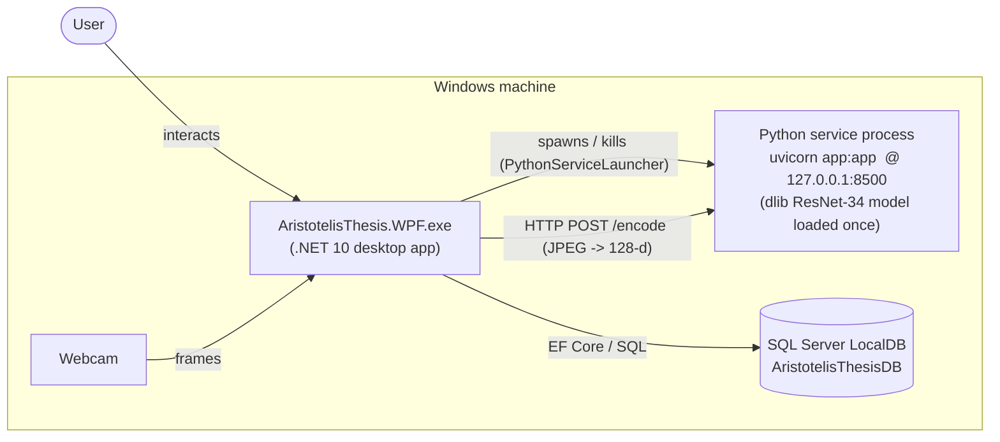

# Runtime / Deployment

The processes that exist at execution time and how they communicate. The WPF application
**auto-starts** the Python service on launch and stops it on exit.

**Notes**
- First launch is slower while dlib loads its model; subsequent `/encode` calls are fast.
- If the Python service can't start, the app still runs — face login simply reports no match.
