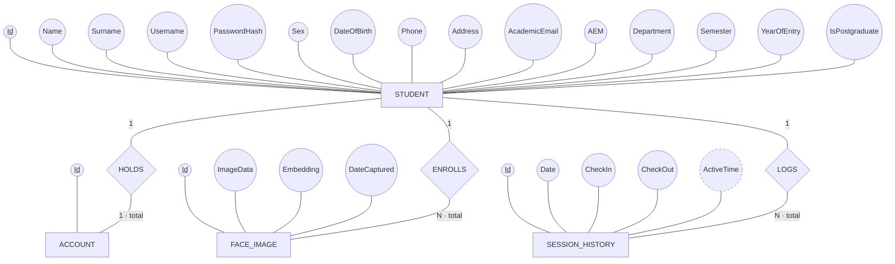
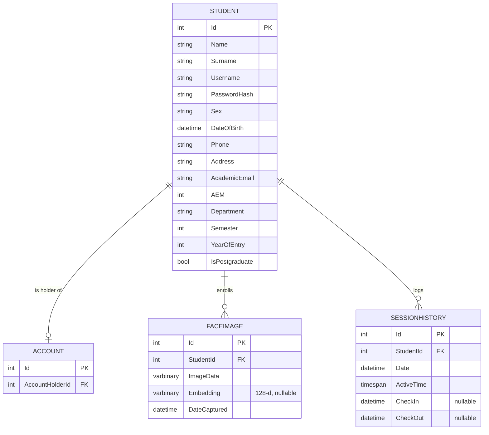

# Entity-Relationship Diagram

Two views of the same data model:
1. **Conceptual** — Elmasri / Navathe (Chen) notation.
2. **Relational** — the implemented tables (Crow's-Foot), showing foreign keys.

---

## 1. Conceptual ER (Elmasri / Navathe notation)

**Legend**
- **Rectangle** = entity type · **Diamond** = relationship type · **Oval** = attribute
- **Underlined** attribute = primary key · **Dashed** oval = derived attribute
- Edge labels = cardinality ratio (`1`, `N`); `total` = total participation (a double line in the
  textbook). Foreign keys are *not* shown as attributes — they are represented by relationships.

> `ActiveTime` is **derived** (accumulated from the day's check-in/check-out), hence the dashed oval.
> `ACCOUNT` participates **totally** in `HOLDS` (every account has a holder); `STUDENT` participates
> partially. `FACE_IMAGE` and `SESSION_HISTORY` participate totally in their relationships.

---

## 2. Relational schema (implemented tables, Crow's-Foot)

This is what EF Core actually creates — foreign keys are explicit columns here. Deleting a
`Student` cascades to its `FaceImage` and `SessionHistory` rows.

