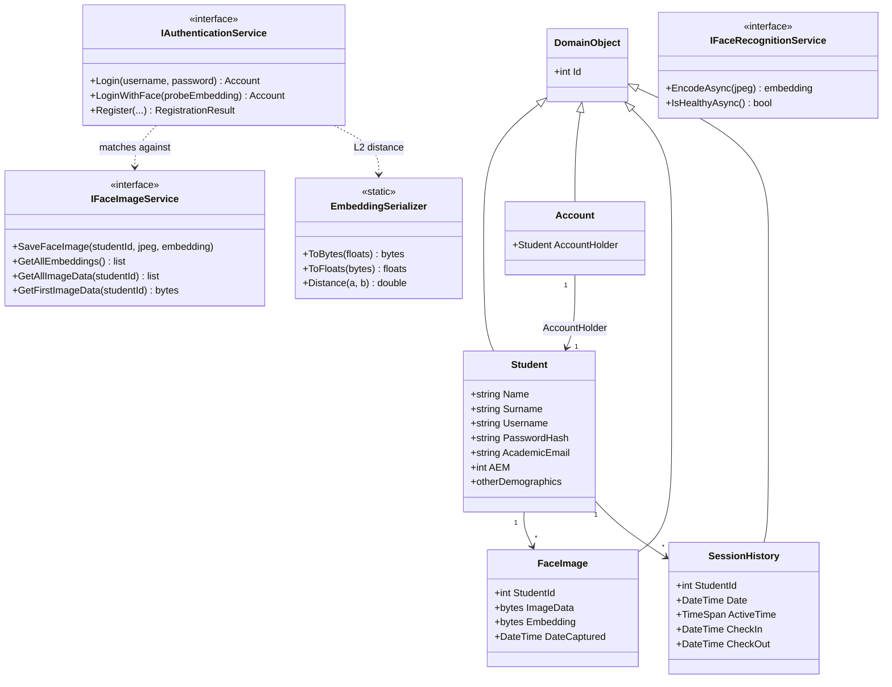

# Domain Class Diagram

Core models and the service interfaces they flow through. Implementations live in the
EntityFramework and WPF layers.

**Key idea:** `IFaceRecognitionService` (implemented over the Python service) only *encodes* a
face into a 128-d embedding; `IAuthenticationService.LoginWithFace` does the *matching* against
the stored embeddings. `ImageData` / `Embedding` are `byte[]` in code (the 128 floats are
packed into 512 bytes via `EmbeddingSerializer`); `CheckIn` / `CheckOut` are nullable.
