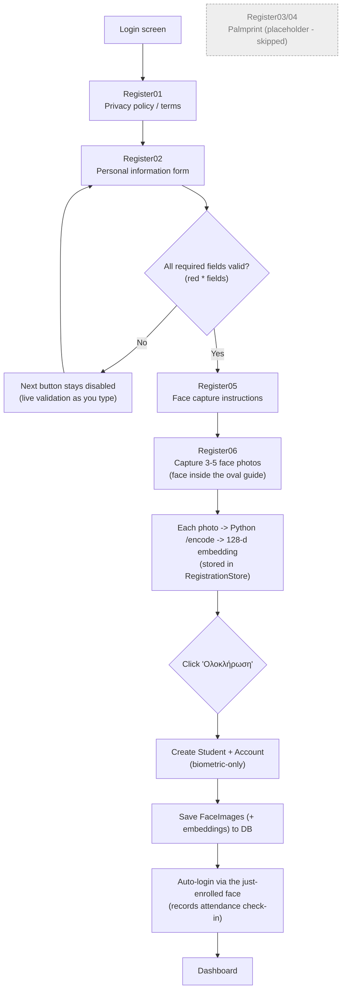

# Registration Flow

The multi-step sign-up wizard. The palmprint steps are currently **skipped** (only face
recognition is implemented), so the info step goes straight to the face steps.

**Notes**
- Personal-info fields are collected into a shared singleton `RegistrationStore`.
- The account is created **once**, at the end (Register06 *Finish*), so an abandoned wizard
  leaves no orphan record.
