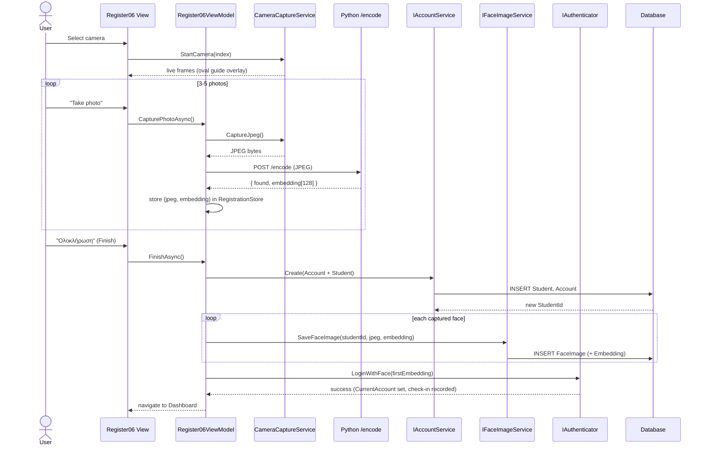

# Face Enrollment Sequence

What happens on the registration face step (`Register06`) when a new user records their face
and finishes registration.

```mermaid
sequenceDiagram
    actor User
    participant View as Register06 View
    participant VM as Register06ViewModel
    participant Cam as CameraCaptureService
    participant Py as Python /encode
    participant Acc as IAccountService
    participant Faces as IFaceImageService
    participant Auth as IAuthenticator
    participant DB as Database

    User->>View: Select camera
    View->>Cam: StartCamera(index)
    Cam-->>View: live frames (oval guide overlay)

    loop 3-5 photos
        User->>View: "Take photo"
        View->>VM: CapturePhotoAsync()
        VM->>Cam: CaptureJpeg()
        Cam-->>VM: JPEG bytes
        VM->>Py: POST /encode (JPEG)
        Py-->>VM: { found, embedding[128] }
        VM->>VM: store (jpeg, embedding) in RegistrationStore
    end

    User->>View: "Ολοκλήρωση" (Finish)
    View->>VM: FinishAsync()
    VM->>Acc: Create(Account + Student)
    Acc->>DB: INSERT Student, Account
    DB-->>Acc: new StudentId
    loop each captured face
        VM->>Faces: SaveFaceImage(studentId, jpeg, embedding)
        Faces->>DB: INSERT FaceImage (+ Embedding)
    end
    VM->>Auth: LoginWithFace(firstEmbedding)
    Auth-->>VM: success (CurrentAccount set, check-in recorded)
    VM-->>View: navigate to Dashboard
```
